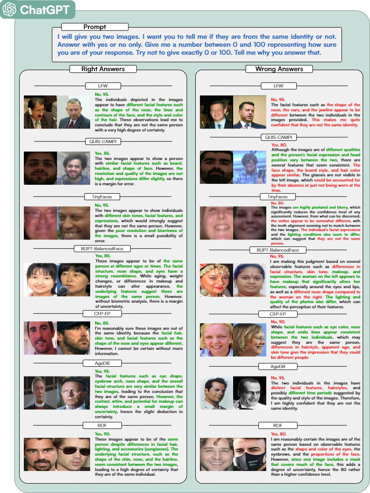

<a href="http://atvs.ii.uam.es/atvs/">
    
</a>

# How Good is ChatGPT at Face Biometrics? A First Look into Recognition, Soft Biometrics, and Explainability

## Table of content

- [How Good is ChatGPT at Face Biometrics? A First Look into Recognition, Soft Biometrics, and Explainability](#how-good-is-chatgpt-at-face-biometrics-a-first-look-into-recognition-soft-biometrics-and-explainability)
  - [Table of content](#table-of-content)
  - [Article](#article)
  - [Experimental Protocol](#experimental-protocol)
    - [Databases](#databases)
    - [Models](#models)
  - [Scripts Usage](#scripts-usage)
  - [References](#references)

## Article

Ivan DeAndres-Tame, Ruben Tolosana, Ruben Vera-Rodriguez, Aythami Morales, Julian Fierrez, Javier Ortega-Garcia, **"How Good is ChatGPT at Face Biometrics? A First Look into Recognition, Soft Biometrics, and Explainability"**, *arXiv preprint arXiv:2401.13641*, doi: [10.48550/arXiv.2401.13641](https://doi.org/10.48550/arXiv.2401.13641), 2024.

<embed  src="media/G_abstract_3.pdf" alt="Graphical Abstract" title="Graphical Abstract" align="center" width="100%" target="_blank"/>

## <a name="exp_prot">Experimental Protocol</a>
We provide the experimental protocol used for this research in the *comparisons* folder. It consists of 8 different databases used for face recognition, explainability, and soft-biometrics estimation. For each database, 1000 meaningful comparisons have been selected and evaluated.

### <a name="ddbb">Databases</a>
We analyze the ability of ChatGPT in different application scenarios (i.e., controlled, surveillance, and extreme conditions) and image qualities. For this purpose, we consider the following databases in the evaluation:

* **[Labeled Faces in the Wild (LFW):](http://vis-www.cs.umass.edu/lfw/)** this is a very popular database in the field, containing high-quality images with no hard variations in pose.
* **[QUIS-CAMPI:](http://quiscampi.di.ubi.pt/)** this database comprises videos and images captured in an uncontrolled outdoor setting using a camera positioned approximately 50 meters away from the subjects.
* **[TinyFaces:](https://qmul-tinyface.github.io/)** this database consists of images of extremely low quality, with an average resolution of 20x16 pixels.

In addition to this, we also evaluate the performance of ChatGPT when considering popular challenges in face recognition such as demographic bias, age and pose variations, and occlusions. The following databases are considered in the evaluation, which are also considered in the recent [FRCSyn Challenge](https://frcsyn.github.io/CVPR2024.html):

* **[BUPT-BalancedFace:](http://www.whdeng.cn/RFW/Trainingdataste.html)** this database is specifically designed to tackle performance variations among various ethnic groups. It comprises eight distinct demographic groups formed by a combination of ethnicities (White, Black, Asian, Indian) and gender (Male, Female). 
* **[Celebrities in Frontal-Profile in the Wild (CFP-FP):](http://www.cfpw.io/)** this database presents images from subjects with great changes in pose and different environmental contexts. 
* **[AgeDB:](https://ibug.doc.ic.ac.uk/resources/agedb/)** this database presents diverse images featuring subjects of varying ages in different environmental contexts.
* **[ROF:](https://github.com/ekremerakin/RealWorldOccludedFaces)** this database consists of occluded faces with both upper face occlusion, due to sunglasses, and lower face occlusion, due to masks.

Finally, for the estimation of soft biometrics, we use the **[MAAD-Face](https://github.com/pterhoer/MAAD-Face)** database. This database provides a total of 47 soft-biometric attributes per face image.

### <a name="models">Models</a>
To perform an evaluation of the ChatGPT capabilities, we compared the face recognition results with two state-of-the-art models.

* **[ArcFace](https://github.com/deepinsight/insightface/tree/master/recognition/arcface_torch)**: this face verification system considers a loss function that maps facial features into a high-dimensional hypersphere where the embeddings are optimized to maximize the angular margins between different identities. The system considered in this study is based on the iResNet-100 architecture pretrained using the MS1Mv3 database. Cosine distance is used to measure the similarity between feature embeddings.
* **[AdaFace](https://github.com/mk-minchul/AdaFace)**: this face verification system proposes a new loss function in order to pay more attention to the harder examples in terms of image quality. In particular, the authors proposed an adaptive margin function that approximates the image quality with feature norms. The system considered in this study is based on the iResNet-100 architecture pretrained using the WebFace12M database. Cosine distance is used to measure the similarity between feature embeddings.

For the soft-biometrics estimation we used a *custom model* to predict all the 47 attributes from MAAD-Face and **[FairFace](https://github.com/joojs/fairface)** to estimate the *gender, age and ethnicity.* 

For the custom model we provide the implementation along with the [*weights*](https://dauam-my.sharepoint.com/:u:/g/personal/ivan_deandres_uam_es/EdJNi3HSxgBIuNd3U1Hxm5oBtMXnJTqVEW133DsulDpE1Q?e=cUgdru).

```python
import torch
import torch.nn as nn
from torchvision import models

class AttributeNN(nn.Module):
    """Base network for learning representations. Just a wrapper for
    resnnet 18 which maps the last layer to 40 outputs instead of the
    1000 used for ImageNet classification.
    """
    def __init__(self, n_labels, pretrain=False):
        super().__init__()
        self.resnet = models.resnet50(pretrained=pretrain)
        self.fc_in_feats = self.resnet.fc.in_features

        self.resnet.fc = nn.Linear(self.fc_in_feats, n_labels, bias=True)
        self.n_labels = n_labels

    def forward(self, x):
        output = self.resnet(x)
        return output

network = AttributeNN(47, False)

state_dict = torch.load(r'path/to/pretrain')
state_dict = {k.replace('model.', 'resnet.'): v for k, v in state_dict.items()}
network.load_state_dict(state_dict)
device = torch.device("cuda:0" if torch.cuda.is_available() else "cpu")
network.to(device)
network.eval()
```
## <a name="exp_prot">Scripts Usage</a>
We provide two different scripts to replicate the experiments we performed in our work.
* `combine_img.py` is used to combine the images in the two different image configurations we propose: *1x1 comparisons* and *4x3 comparisons*.


```
python combine_img.py --df_name comparisons/file/.csv 
                      --append_path append/path/for/the/images/in/comparison_file 
                      --path_save_combined where/to/save/1x1images 
                      --path_save_matrix where/to/save/4x3images
```

* `eval_ChatGPT_DDBB.ipynb` is the jupyter notebook used to evaluate the images through ChatGPT. You need to set your [OpenAI API Key](https://platform.openai.com/api-keys) and the path of the CSV generated used `combine_img.py`.



## <a name="references">References</a>

For further information on the experiments and results, we refer the reader to:

Ivan DeAndres-Tame, Ruben Tolosana, Ruben Vera-Rodriguez, Aythami Morales, Julian Fierrez, Javier Ortega-Garcia, **"How Good is ChatGPT at Face Biometrics? A First Look into Recognition, Soft Biometrics, and Explainability"**, *arXiv preprint arXiv:2401.13641*, doi: [10.48550/arXiv.2401.13641](https://doi.org/10.48550/arXiv.2401.13641), 2024.

Please remember to reference the above articles on any work made public, whatever the form, based directly or indirectly on any part of the our work.
